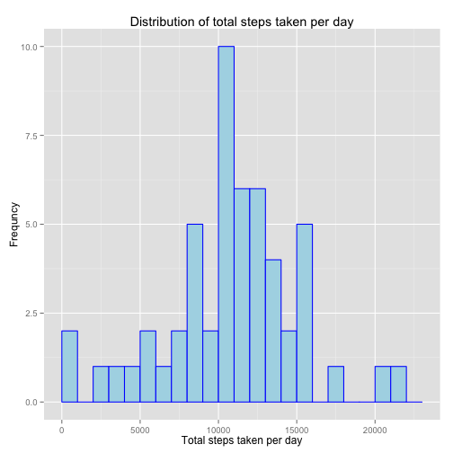
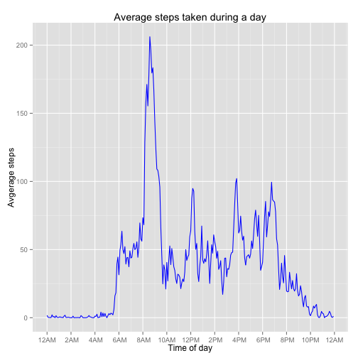
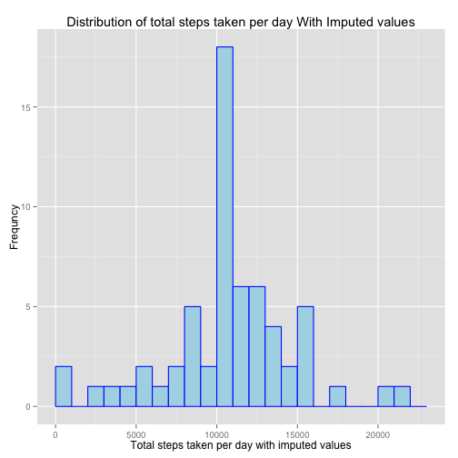
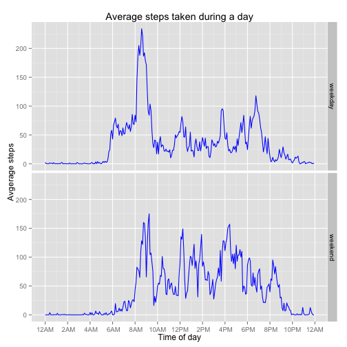

## Loading and preprocessing the data

1. Load Dependencies

```r
library(stringr)
library(lubridate)
library(ggplot2)
library(scales)
```

2. Load Data

```r
unzip("activity.zip")
activityData <- read.csv('activity.csv')
```

3. Transform data

```r
activityData$datetime <- ymd_hm(paste(activityData$date,
                                      str_pad(activityData$interval, 4, 
                                              pad = "0")))
```


## What is mean total number of steps taken per day?

1. Calculate the total number of steps taken per day

```r
dailyActivity <- aggregate(steps ~ date, activityData, FUN = sum)
```

2. If you do not understand the difference between a histogram and a barplot, 
research the difference between them. Make a histogram of the total number of 
steps taken each day


```r
ggplot(data=dailyActivity, aes(x = steps)) + 
  geom_histogram(col="blue", fill='lightblue', binwidth=1000) + 
  labs(title="Distribution of total steps taken per day") +
  labs(x="Total steps taken per day", y="Frequncy") + 
  xlim(c(0,23000))
```

 

3. Calculate and report the mean and median of the total number of steps taken 
per day

Mean

```r
mean(dailyActivity$steps)
```

```
## [1] 10766.19
```
Median

```r
median(dailyActivity$steps)
```

```
## [1] 10765
```


## What is the average daily activity pattern?

1. Make a time series plot (i.e. `type = "l"`) of the 5-minute interval (x-axis) 
and the average number of steps taken, averaged across all days (y-axis)

Calculate average per interval

```r
intervalMeanActivity <- aggregate(steps ~ interval, activityData, FUN = mean)
intervalMeanActivity$time <- as.POSIXct(
  str_pad(intervalMeanActivity$interval, 4, pad = "0"), 
  format="%H%M", tz = 'GMT')

ggplot(intervalMeanActivity, aes(x = time, y = steps)) +
  geom_line(col='blue') + 
  scale_x_datetime(breaks = date_breaks("2 hours"), 
                   minor_breaks=date_breaks("1 hour"), 
                   labels=date_format("%l%p"))+
  labs(title="Average steps taken during a day") +
  labs(x="Time of day", y="Avgerage steps")
```

 

2. Which 5-minute interval, on average across all the days in the dataset, 
contains the maximum number of steps?

Maximum average step interval

```r
intervalMeanActivity[which.max(intervalMeanActivity$steps),]$interval
```

```
## [1] 835
```


## Imputing missing values

Note that there are a number of days/intervals where there are missing values 
(coded as NA). The presence of missing days may introduce bias into some 
calculations or summaries of the data.

1. Calculate and report the total number of missing values in the dataset (i.e.
the total number of rows with NAs)

```r
sum(is.na(activityData$steps))
```

```
## [1] 2304
```

2. Devise a strategy for filling in all of the missing values in the dataset. 
The strategy does not need to be sophisticated. For example, you could use the 
mean/median for that day, or the mean for that 5-minute interval, etc.

My strategy is to replace missing values with the mean value of all intervals

```r
meanIntervalValue = mean(intervalMeanActivity$steps)
```

3. Create a new dataset that is equal to the original dataset but with the 
missing data filled in.

```r
activityDataWithImputation <- activityData
activityDataWithImputation[which(
  is.na(activityDataWithImputation$steps)),]$steps = meanIntervalValue
```

4. Make a histogram of the total number of steps taken each day and Calculate 
and report the mean and median total number of steps taken per day. Do these 
values differ from the estimates from the first part of the assignment? What is 
the impact of imputing missing data on the estimates of the total daily number
of steps?

```r
  dailyActivityWithImputation <- aggregate(steps ~ date, 
                                           activityDataWithImputation, 
                                           FUN = sum)
```
Histogram

```r
ggplot(data=dailyActivityWithImputation, aes(x = steps)) + 
  geom_histogram(col="blue", fill='lightblue', binwidth=1000) + 
  labs(title="Distribution of total steps taken per day With Imputed values") +
  labs(x="Total steps taken per day with imputed values", y="Frequncy") + 
  xlim(c(0,23000))
```

 
Mean

```r
mean(dailyActivityWithImputation$steps)
```

```
## [1] 10766.19
```
Median

```r
median(dailyActivityWithImputation$steps)
```

```
## [1] 10766.19
```

The mean of 10766.19 didn't change at all from before the missing data 
imputation. After the data imputation, the median increased from 10765 to 10766.19, matching the mean.


## Are there differences in activity patterns between weekdays and weekends?

For this part the `weekdays()` function may be of some help here. Use the 
dataset with the filled-in missing values for this part.

1. Create a new factor variable in the dataset with two levels – “weekday” and
“weekend” indicating whether a given date is a weekday or weekend day.

```r
activityData$typeOfDay <- factor(ifelse(wday(activityData$date) %in% c(1,7), 
'weekend', 'weekday'))
```

2. Make a panel plot containing a time series plot (i.e. `type = "l"`) of the
5-minute interval (x-axis) and the average number of steps taken, averaged 
across all weekday days or weekend days (y-axis). See the README file in the
GitHub repository to see an example of what this plot should look like using
simulated data.


```r
intervalDayTypeMeanActivity <- aggregate(steps ~ interval + typeOfDay, 
                                         activityData, 
                                         FUN = mean)
intervalDayTypeMeanActivity$time <- as.POSIXct(
  str_pad(intervalDayTypeMeanActivity$interval, 4, pad = "0"), 
  format="%H%M", tz = 'GMT')

ggplot(intervalDayTypeMeanActivity, aes(x = time, y = steps)) +
  facet_grid(typeOfDay ~ .) +
  geom_line(col='blue') + 
  scale_x_datetime(breaks = date_breaks("2 hours"), 
                   minor_breaks=date_breaks("1 hour"), 
                   labels=date_format("%l%p"))+
  labs(title="Average steps taken during a day") +
  labs(x="Time of day", y="Avgerage steps")
```

 
